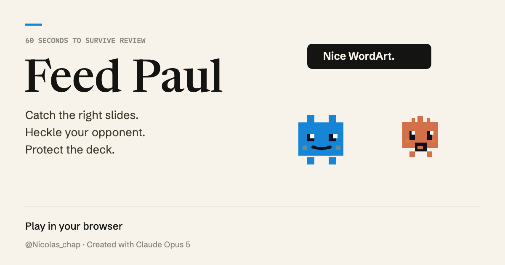

# Feed Paul

Sixty seconds to build a deck that survives review.

**[Play Feed Paul](https://nickchaps.github.io/feed-paul/)** · [Download the game and video](https://github.com/NickChaps/feed-paul/releases/latest)



Slides fall. Catch the ones that match the live template, dodge the parasites, and watch the brief change every nine seconds. Your score is **points × brand cohesion**. A crowded deck is no use if it falls apart at review.

Choose Paul or The Other, then face an Intern, Competent, or Ruthless opponent. Gold master slides work with every template. Completing a brief earns five extra points.

## Credits

**Original game created with Claude Opus 5, prompted and published by Nicolas Chapuis ([@Nicolas_chap](https://x.com/Nicolas_chap)).**

Codex prepared this public edition: corrected scoring instructions, mobile HUD and touch movement, keyboard navigation, pause and resume, sharing, offline fonts, the Up-arrow heckle, and the gameplay video. The game concept, characters, Canvas renderer, rules, and synthesized soundtrack come from the original HTML game.

The Other is a fictional opponent. The creator credit identifies the tool used to make the original game; it is not an endorsement or affiliation.

## Play

Open `index.html` in a modern browser. The game, Latin font files, music, and sound effects are contained in that file. No install, account, API key, or network connection is needed to play. Social sharing links need a connection.

- Move with a mouse, a finger, the arrow keys, A/D, or Q/D.
- Press ↑ to heckle your opponent. It distracts them for 0.9 seconds, with a seven-second cooldown. There is a touch button too.
- Press P or Escape to pause and resume. Switching away from the game pauses it automatically.
- Music starts on the character-selection screen with your first click, tap, or key press, and returns when you go back to the menu. Browsers require that first interaction before playing audio. Use the music and sound buttons independently; saved mute preferences are respected.
- At the end, replay, change character, copy the link, or prepare a score post on X.

Your best score and audio preferences stay in browser local storage. There is no analytics service or backend.

## Rules

| Slide | Points | Cohesion |
| --- | ---: | ---: |
| On template | +1 | +5 |
| Overloaded, on template | +3 | −5 |
| Parasitic, on template | 0 | −12 |
| Off template | 0 | −9 |
| Gold master, any template | +5 | +20 |

Cohesion stays between 0 and 100. The previous template remains valid for 1.8 seconds after a brief change. Both characters can catch the same slide. The score at review is rounded to the nearest whole point.

## Development and verification

The game has **zero runtime JavaScript dependencies**. Node 22+ and Playwright are optional, for verification and recording only.

```sh
npm ci --ignore-scripts
npm start
```

In another terminal, with Google Chrome installed:

```sh
npm run verify
npm run record
```

Set `BROWSER_CHANNEL` to another supported installed Playwright browser channel if needed. The `?inspect` URL enables a local inspection bridge used by these scripts; normal games do not run an automatic player. The video explicitly labels its automated performance as a gameplay demo, uses the normal rules, and records the game's own live Web Audio soundtrack.

`npm run verify` checks keyboard and touch controls, pause/resume, scoring, persistent best scores, share drafts, and a complete 60-second round. `npm run record` writes the full WebM capture to `output/`. Run `bash scripts/encode.sh` with FFmpeg installed to make the MP4 versions.

## License

Code and game assets: [MIT](LICENSE). Embedded fonts: SIL Open Font License; see [FONT-LICENSES.txt](FONT-LICENSES.txt). Newsreader, Schibsted Grotesk, and IBM Plex Mono were retrieved from the official Google Fonts service and repository.
